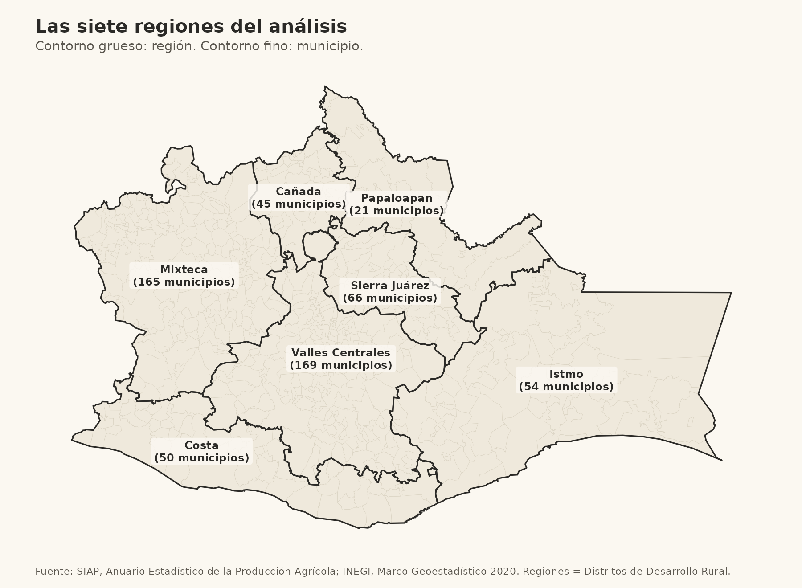
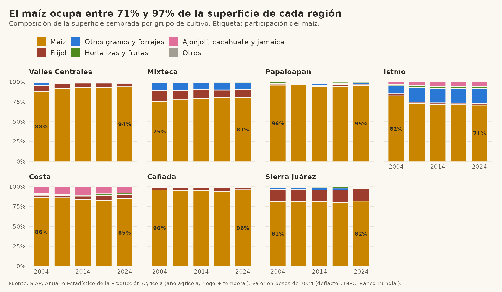
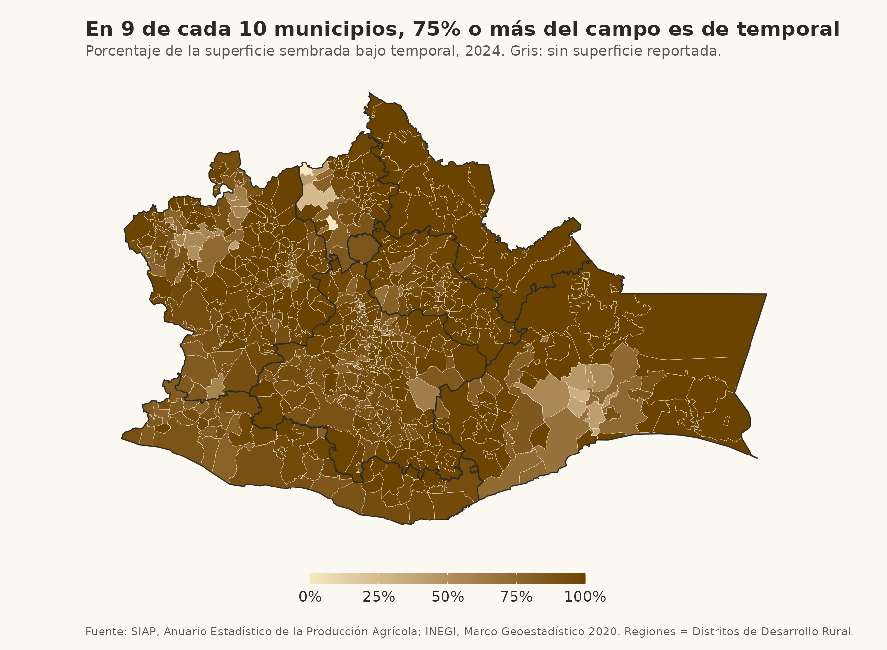
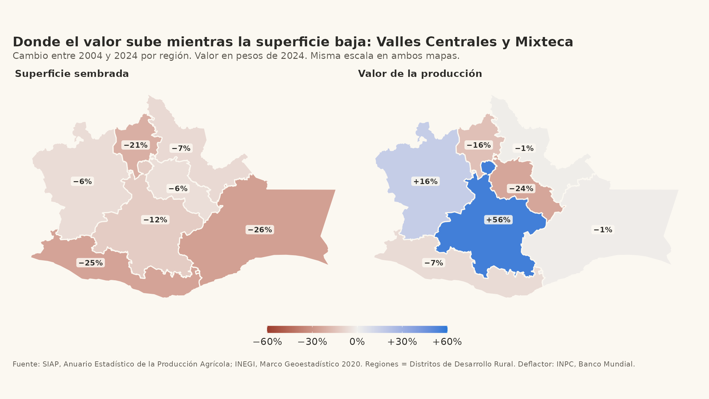
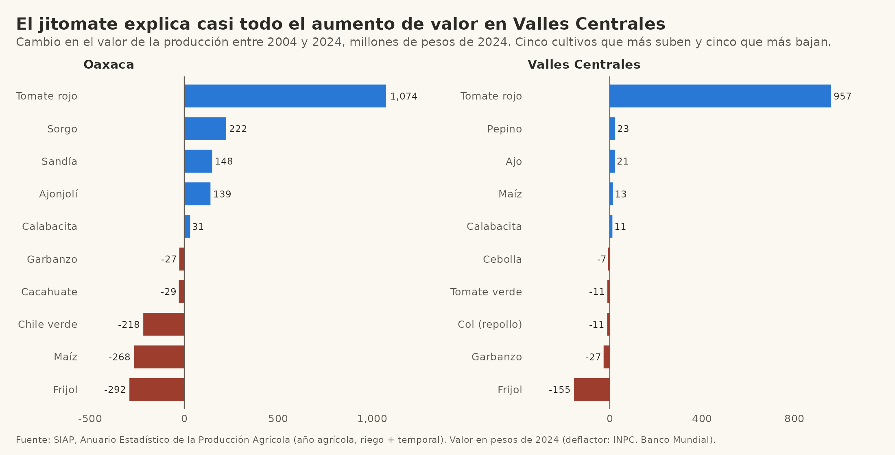
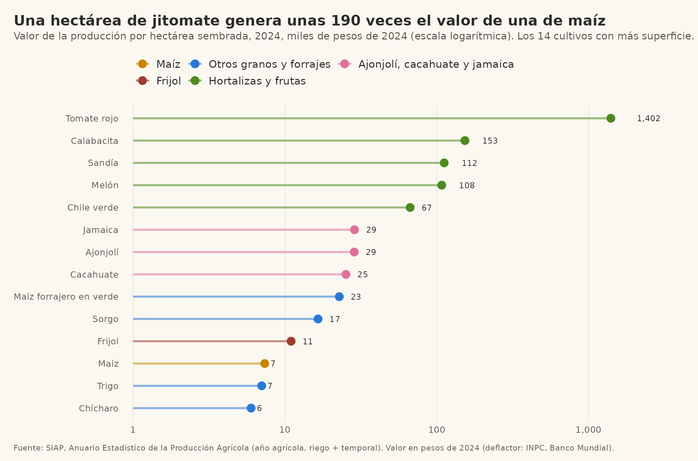
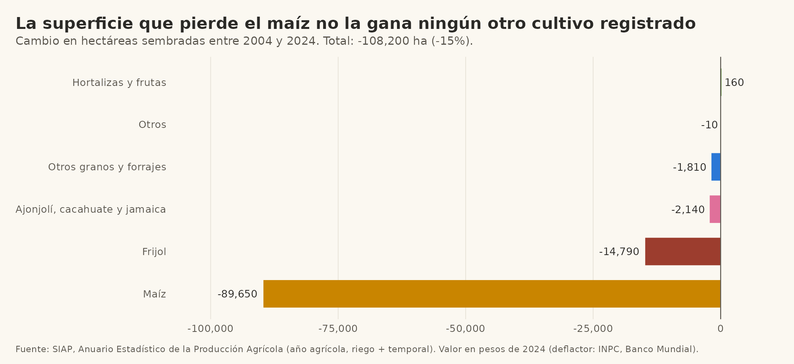
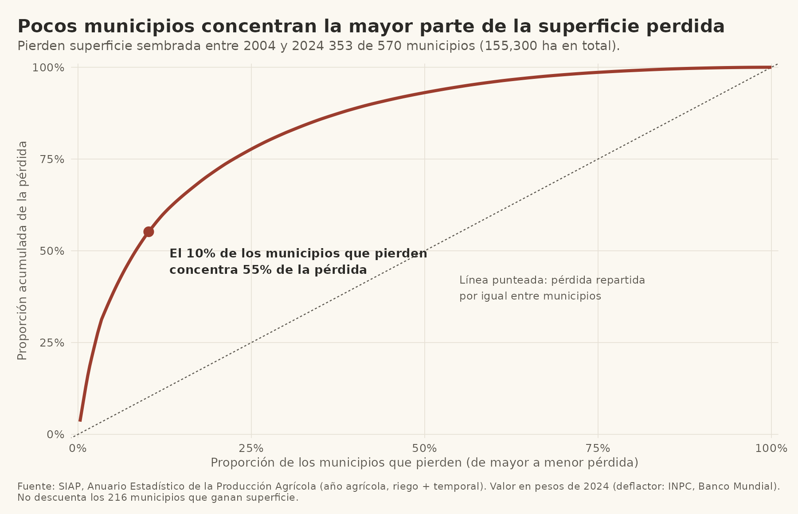
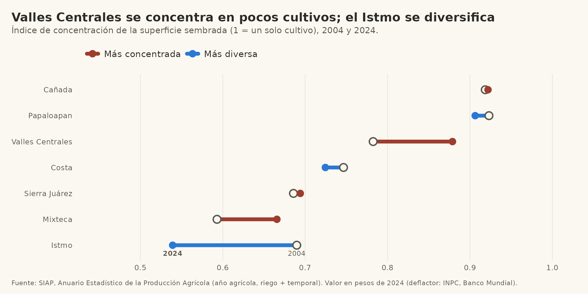

*Proyecto realizado como asistente de investigación en NORIA, con su autorización. Es un ejercicio analítico para el portafolio, no una base para decidir políticas.*

## Pregunta

Este análisis es parte de una investigación más amplia sobre por qué las personas productoras agrícolas empiezan a sembrar ciertos cultivos (lícitos o ilícitos) y por qué lo hacen de manera formal o informal. El objetivo de largo plazo es proponer medidas que fortalezcan su autonomía, tanto frente al Estado como frente a grupos armados. **No** busca aumentar la productividad por hectárea ni empujar a nadie hacia el sector formal.

La pregunta de esta etapa es más modesta: con la información oficial disponible, **¿qué cambió en lo que se siembra en Oaxaca entre 2004 y 2024, y dónde hay huecos en esa información?**

## Datos y alcance

- **Fuente:** Cierre agrícola del Servicio de Información Agroalimentaria y Pesquera (SIAP), por municipio, para 2004, 2009, 2014, 2019 y 2024, en riego y temporal.
- **Unidad:** hectáreas sembradas y valor de la producción por municipio. No hay datos de parcelas ni de productores individuales.
- **Valores:** en miles de pesos, expresados en pesos de 2024 con el índice de precios al consumidor del Banco Mundial.
- **Regiones:** las 7 de SIAP (Distritos de Desarrollo Rural). No coinciden del todo con las 8 regiones oficiales del estado; la discrepancia viene de las propias fuentes del gobierno estatal y de SIAP.

::: {.callout-warning}
## Lo que esta base no incluye
Solo contiene **cultivos cíclicos** (otoño-invierno y primavera-verano): 43 cultivos, de maíz a flores. **No incluye perennes** como café, mango, agave o caña, ni pastos. Por eso, cuando aquí se habla de "la superficie", se trata de la superficie sembrada de cultivos cíclicos registrados, no de toda la tierra agrícola de Oaxaca. Tampoco incluye lo que se cultiva fuera del registro.
:::

## Las regiones

{fig-alt="Mapa de Oaxaca con sus siete regiones de análisis y el número de municipios de cada una."}

## Qué se siembra

El maíz domina: ocupa entre 71% y 97% de la superficie de cada región, y en 9 de cada 10 municipios al menos tres cuartas partes del campo es de temporal.

{fig-alt="Barras apiladas con la composición de la superficie sembrada por cultivo en cada región y año."}

{fig-alt="Mapa municipal del porcentaje de superficie bajo temporal en 2024; la gran mayoría de los municipios supera el 75 por ciento."}

## Superficie y valor se mueven distinto

Entre 2004 y 2024 la superficie sembrada baja en todas las regiones. El valor de la producción, en pesos constantes, solo sube en Valles Centrales y en la Mixteca.

{fig-alt="Dos mapas de las regiones de Oaxaca: cambio en superficie sembrada y cambio en valor de la producción entre 2004 y 2024, con la misma escala."}

Esa divergencia no es una tendencia general. En Valles Centrales casi todo el aumento viene de un cultivo, el jitomate:

{fig-alt="Barras con los cultivos que más suben y más bajan en valor entre 2004 y 2024, en Oaxaca y en Valles Centrales; el jitomate domina el aumento."}

Una hectárea de jitomate genera unas 190 veces el valor de una de maíz (unos 1.4 millones de pesos frente a unos 7 mil), pero ocupa poco más de 900 hectáreas en todo el estado.

{fig-alt="Valor por hectárea de los 14 cultivos con más superficie en 2024, en escala logarítmica; el jitomate está muy por encima del resto y el maíz entre los más bajos."}

## ¿A dónde se va la tierra?

La superficie sembrada de cíclicos bajó 15% (unas 108 mil hectáreas). El maíz explica 83% de esa baja y ningún otro cultivo registrado crece de forma apreciable: **la tierra que deja de sembrarse con maíz no aparece sembrada con otra cosa dentro de este registro.**

{fig-alt="Cambio en hectáreas sembradas por grupo de cultivo entre 2004 y 2024; el maíz pierde cerca de 90 mil hectáreas y el frijol cerca de 15 mil; hortalizas y frutas apenas ganan 160."}

La pérdida tampoco es pareja. Pierden superficie 353 de los 570 municipios, y el 10% de ellos concentra 55% de la pérdida.

{fig-alt="Curva de concentración: proporción acumulada de la superficie perdida frente a la proporción de municipios que pierden, ordenados de mayor a menor pérdida."}

La concentración también se ve entre cultivos. Valles Centrales y la Mixteca se concentran en menos cultivos, y el Istmo se diversifica:

{fig-alt="Índice de concentración de la superficie por cultivo en cada región, 2004 y 2024."}

## Hipótesis

Lo que sigue son hipótesis de trabajo, no conclusiones. Cada una indica qué sostienen hoy los datos y qué haría falta para ponerla a prueba.

| | Hipótesis | Qué se observa hoy | Qué falta |
|---|---|---|---|
| **H1** | La superficie que se pierde **sale del registro**, más que cambiar a otro cultivo registrado. | El maíz y el frijol pierden unas 104 mil ha; las hortalizas ganan 160. | Comparar con el Censo Agropecuario 2022 y con padrones de programas. |
| **H2** | Parte de la tierra pasa a **perennes, pastos u otros usos** que esta base no recoge. | No se puede evaluar: la base no los incluye. | Descargar el cierre agrícola de perennes y revisar uso de suelo. |
| **H3** | El acceso a cultivos de alto valor está limitado por **riego y capital**. | El valor crece donde hay riego; el jitomate pesa mucho en poca tierra. | Infraestructura de riego, crédito, caminos y compradores. |
| **H4** | La baja del valor del maíz refleja **precios y costos**, no solo menos tierra. | El valor real del maíz cae, pero la base no separa precio de volumen. | Volumen de producción, rendimiento y precios medios rurales (SIAP). |
| **H5** | La pérdida se concentra en **municipios de mucha superficie sembrada**. | El cuarto más grande de municipios en 2004 explica 82% de la pérdida neta. | Tenencia de la tierra y estructura de las unidades de producción. |

## Preguntas abiertas

Los datos oficiales dejan sin explicar lo que más importa para la investigación:

1. **¿Qué tan completo es el registro?** Cada municipio reporta superficie en todos los años, pero eso no dice qué tan cerca está de lo que realmente se siembra. Falta contrastarlo con otras fuentes.
2. **¿Qué hay fuera del registro?** Los cultivos no registrados no aparecen en estos datos por construcción, y por eso no se puede inferir nada sobre ellos desde aquí.
3. **¿Cómo se producen las diferencias de valor?** La brecha entre cultivos puede deberse a precios, intermediarios, tecnología o acceso a mercados. No se sabe quién captura el valor.
4. **¿Qué decide cambiar de cultivo?** Los agregados regionales muestran contexto, no decisiones. Cruzar con migración y remesas, crédito, programas, tenencia de la tierra y seguridad permitiría empezar a responder, a nivel municipal y con cuidado de no atribuir conductas individuales a partir de promedios.
5. **¿Qué cambia cuando una región se diversifica?** El Istmo pasó de un cultivo dominante a un reparto más parejo. Falta saber qué lo explica y si fue decisión de los productores o vino de programas, compradores o precios.

## Limitaciones

- Solo cultivos cíclicos registrados; sin perennes, pastos ni cultivos fuera del registro.
- Datos agregados por municipio, sin parcelas ni productores.
- El valor depende de los precios que reporta SIAP y del deflactor elegido.
- Cinco cortes en el tiempo (2004, 2009, 2014, 2019, 2024), sin los años intermedios.
- Las regiones de SIAP no coinciden del todo con las 8 regiones oficiales del estado.
- Las hipótesis son para orientar la investigación, no se prueban estadísticamente aquí.

**Fuentes:** SIAP, Anuario Estadístico de la Producción Agrícola (nube.agricultura.gob.mx); INEGI, Marco Geoestadístico 2020; Banco Mundial, índice de precios al consumidor de México.
